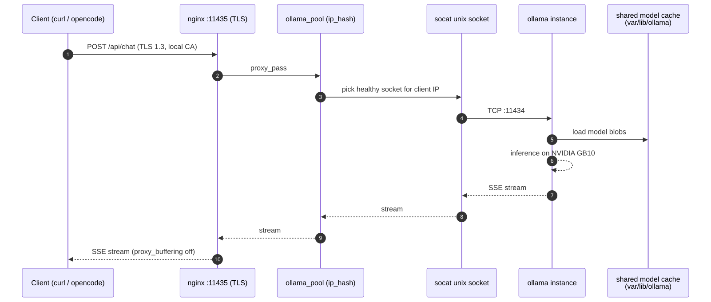
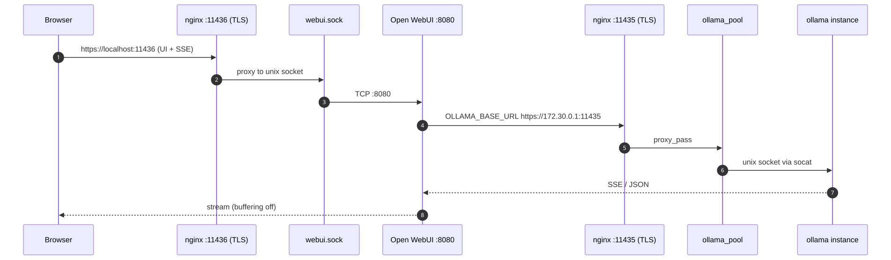

# ollama-serve

A self-hosted, TLS-only Ollama serving stack for a single GPU host (NVIDIA DGX
Spark / GB10). It runs two Ollama instances behind an nginx reverse proxy with
dynamic, health-checked upstreams, plus Open WebUI for a browser interface. Every path into the stack is HTTPS; nothing is published as
plain HTTP.

## Highlights

- **2 GPU Ollama instances** on the same host, each with full GPU access via
  NVIDIA CDI (`nvidia.com/gpu=all`).
- **Shared model cache** — all instances mount the same `var/lib/ollama` host
  directory, so each model is downloaded exactly once.
- **Keep-alive pinned** (`OLLAMA_KEEP_ALIVE=-1`) so models stay resident and
  never reload between requests; large context (`OLLAMA_CONTEXT_LENGTH=64000`).
- **Dynamic upstream pool** — `healthcheck.sh` probes each instance's socket
  every 5 s and regenerates the nginx upstream, reloading only on change. Failed
  instances are dropped from the pool automatically.
- **Round-robin load balancing** — nginx spreads requests across the healthy
  instances automatically.
- **HTTPS-only entry points** on `:11435` (Ollama API) and `:11436` (Open WebUI),
  served by a self-signed local CA.
- **Hardened containers** — non-root user (`1000:1000`), `no-new-privileges`,
  and `cap_drop: ALL` on every service.
- **No TCP ports published** except through nginx: containers talk over unix
  sockets bridged by socat.
- **Optional eBPF telemetry** — opt-in OpenTelemetry traces and metrics for the
  whole stack via [OBI](https://opentelemetry.io/docs/zero-code/obi/), with no
  code changes and no restarts. Off by default; see
  [eBPF telemetry](#ebpf-telemetry-optional).

## Architecture



### Services and ports

| Service       | Container port | Host exposure                                  | Purpose                          |
| ------------- | -------------- | ---------------------------------------------- | -------------------------------- |
| `nginx`       | —              | `:11435` (HTTPS), `:11436` (HTTPS)             | TLS front door for the whole stack |
| `ollama-1..2` | `:11434`       | none (reached via unix sockets)                | GPU inference instances          |
| `socat-1..2`  | —              | `var/run/sockets/ollama-N.sock` (unix)         | Bridge TCP `:11434` to sockets   |
| `webui`       | `:8080`        | none (reached via unix socket)                 | Open WebUI                       |
| `socat-webui` | —              | `var/run/sockets/webui.sock` (unix)            | Bridge TCP `:8080` to a socket   |
| `obi`         | —              | none                                           | eBPF instrumentation (optional)  |
| `otelcol`     | `:4317/:4318`  | none (reached on the `otel` network)            | OTLP collector (optional)        |

### Request flow (Ollama API)



A client calls `https://localhost:11435/v1`. nginx terminates TLS, selects a
healthy socket via round-robin, and streams the response back with
`proxy_buffering off` so SSE works end to end.

### Request flow (Open WebUI)



The browser loads the UI over `https://localhost:11436`. Open WebUI then calls
back out through the host bridge gateway (`172.30.0.1`) to the same nginx pool
over TLS, using the CA baked into its image. This is why the compose bridge
subnet is pinned: the gateway `172.30.0.1` must be deterministic and present in
the server certificate's SANs.

### Health checks and automatic failover



```sh
healthcheck.sh --watch` runs inside the nginx container. Every 5 s it curls
`/api/version` over each `ollama-N.sock`. If the healthy set changed, it writes
`var/run/nginx/upstream.conf` and reloads nginx — a crashed or restarting
instance is removed from the pool with zero downtime.
```

## Repository layout
```
├── docker-compose.yml      # The whole stack
├── docker-compose.otel.yml # Optional telemetry overlay (off by default)
├── .env.example            # Copy to .env; where every optional knob lives
├── otel/                   # Telemetry plane, one dir per component
│   ├── obi/config.yaml     # What OBI instruments, and how routes are named
│   └── otelcol/            # Collector pipelines: local.yaml, forward.yaml
├── nginx/
│   ├── nginx.conf          # :11435 pool + :11436 webui, TLS-only
│   ├── healthcheck.sh      # Dynamic upstream watcher
│   └── certs/              # Local CA + server cert (gitignored)
├── webui/
│   └── Dockerfile          # Open WebUI + baked-in CA trust
├── var/                    # Runtime data (gitignored)
│   ├── lib/ollama          # Shared model cache
│   ├── lib/webui           # SQLite DB + uploads
│   ├── run/sockets         # unix sockets
│   └── run/nginx           # generated upstream.conf
├── docs/diagrams/          # Mermaid sources + rendered SVG/PNG diagrams
└── opencode.json           # Example: point opencode at the local pool
```

## Prerequisites

- Docker + Docker Compose (v2).
- NVIDIA Container Toolkit with CDI enabled (used for `driver: cdi`).
- Run `./setup.sh` to create the required directories and self-signed certificates before starting the stack.

## Getting started

```sh
# Run the setup script to create directories and generate self-signed certificates
./setup.sh

# Start the stack (builds the webui image first time)
docker compose up --build -d

# Pull a model on one instance — it lands in the shared cache
docker compose exec ollama-1 ollama pull glm-4.7-flash

# Use it
curl -k https://localhost/11435/api/tags            # trust the CA to drop -k
curl -k https://localhost/11435/v1/chat/completions -d '{
  "model": "glm-4.7-flash",
  "messages": [{"role": "user", "content": "hello"}]
}'
```

Open the UI at <https://localhost:11436> (first-run: create the admin account).

## Configuration knobs

| Setting                              | Where                     | Effect                                   |
| ------------------------------------ | ------------------------- | ---------------------------------------- |
| `OLLAMA_CONTEXT_LENGTH=32768`        | compose `x-ollama-base`   | Context window for large models          |
| `OLLAMA_NUM_PARALLEL=2`             | compose `x-ollama-base`   | Two parallel requests per model (2x context size per request) |
| Number of instances (`1..2`)         | compose `services`        | Scale the pool (and `INSTANCES` in `healthcheck.sh`) |
| `keepalive 32`                       | generated `upstream.conf` | Connection reuse                          |
| `OLLAMA_BASE_URL` / `WEBUI_URL`      | compose `webui`           | WebUI backend URL + public UI URL        |
| Probe interval (`INTERVAL=5`)        | `nginx/healthcheck.sh`    | Health-check cadence                     |
| Everything under `OBI_*` / `OTELCOL_*` | `.env`                  | eBPF telemetry, see below                |

## eBPF telemetry (optional)

[OpenTelemetry eBPF Instrumentation](https://opentelemetry.io/docs/zero-code/obi/)
(OBI) attaches kernel probes to the processes already running in this stack and
emits OTLP traces and metrics from them. Nothing in the base stack is modified,
rebuilt, or restarted to enable it — ollama, nginx and the webui are unaware
they are being observed.

It is **off by default**. All of it lives in `docker-compose.otel.yml`, which is
purely additive: the base stack behaves identically whether or not the overlay
is loaded.



Note the direction of the arrows: OBI never talks to the base stack over the
network. It observes it through the kernel and only *emits* over the network,
which is exactly why the overlay needs no change to `docker-compose.yml`.

### Enabling it

```sh
cp .env.example .env      # setup.sh already does this
```

Uncomment this one line in `.env`:

```sh
COMPOSE_FILE=docker-compose.yml:docker-compose.otel.yml
```

Then bring the stack up as usual — `obi` and `otelcol` join it:

```sh
docker compose up -d
```

To try it without touching `.env`:

```sh
docker compose -f docker-compose.yml -f docker-compose.otel.yml up -d
```

### Disabling it

Remove the two containers **before** unloading the overlay, otherwise Compose
forgets they exist and leaves them running:

```sh
docker compose down
```

Then re-comment `COMPOSE_FILE` in `.env` and `docker compose up -d`.

### What gets instrumented

Selectors live in `otel/obi/config.yaml`. OBI runs with `pid: host`, so it can
see every process on the machine; the selectors are what keep it scoped to this
stack. Each one requires a **listening port** *and* `containers_only: true`, so
host daemons and unrelated containers are never touched.

| Service      | Matched on   | Reported as                                     |
| ------------ | ------------ | ----------------------------------------------- |
| `ollama-1/2` | port 11434   | `ollama` — instances split by `service.instance.id` |
| `nginx`      | ports 11435, 11436 | `nginx`                                   |
| `webui`      | port 8080    | `open-webui`                                    |
| `socat-*`    | —            | excluded (it only shuttles bytes, and would double-count) |

Both ollama instances listen on 11434 inside their own network namespaces, so a
single selector covers the pool and `service.instance.id` distinguishes them —
which is usually what you want from a load-balanced pool.

Request paths are collapsed into low-cardinality route names. The Ollama and
OpenAI-compatible endpoints are listed explicitly in `routes.patterns`;
everything else (notably Open WebUI's `/api/v1/chats/<uuid>` paths) falls back
to OBI's heuristic matcher so metric cardinality stays bounded.

### Where the data goes

OBI exports OTLP to the bundled collector on a dedicated `otel` bridge network.
Nothing is published on the host. `OTELCOL_CONFIG_FILE` in `.env` picks the
pipeline:

| Config                       | Behaviour                                                      |
| ---------------------------- | -------------------------------------------------------------- |
| `otel/otelcol/local.yaml` (default) | Stays on the box: span/metric counts in `docker compose logs otelcol`, plus a Prometheus scrape endpoint at `otelcol:8889/metrics` on the `otel` network |
| `otel/otelcol/forward.yaml`   | Relays traces and metrics to the OTLP/HTTP backend in `OTLP_FORWARD_ENDPOINT` |

To skip the collector entirely, point `OBI_OTLP_ENDPOINT` straight at your own
OTLP endpoint.

### Checking it works

```sh
docker compose logs obi | head -20
```

`starting Application Observability mode` means OBI loaded its probes. To watch
actual spans, set `OBI_TRACE_PRINTER=text` in `.env`, `docker compose up -d obi`,
send a request through `https://localhost:11435`, then:

```sh
docker compose logs -f obi
```

Set it back to `disabled` when you're done — it prints every span.

Scrape the collector's Prometheus endpoint. It is not published on the host, and
the collector image has no shell, so do it from a throwaway container on the
`otel` network — `alpine/socat` is already part of the stack, so nothing new is
pulled:

```sh
docker run --rm --network ollama-serve_otel --entrypoint wget alpine/socat -qO- http://otelcol:8889/metrics
```

### Cost

`OBI_METRICS_INSTRUMENTATIONS` and `OBI_TRACES_INSTRUMENTATIONS` default to just
the protocols this stack speaks (`http`, `grpc`, `genai`, `gpu`) rather than
OBI's `*`, since every extra entry attaches more probes. The collector is capped
at 768 MB with an internal `memory_limiter` that sheds telemetry below that, so
observability can never starve the GPU workload.

## Trusting the CA

- **Host / browsers**: add `nginx/certs/ca.crt` to your system/browser trust
  store, then `https://localhost:11435` and `https://localhost:11436` validate
  without warnings.
- **WebUI container**: done automatically via `webui/Dockerfile`
  (`update-ca-certificates` + `SSL_CERT_FILE`/`REQUESTS_CA_BUNDLE`).
- **opencode**: see `opencode.json`, which points `baseURL` at
  `https://localhost:11435/v1` with the local CA trusted by the system store.

## Troubleshooting

- **Upstream empty / all instances down** — check `var/run/nginx/upstream.conf`;
  the health checker only lists sockets whose `/api/version` probe succeeds.
  Verify the sockets exist (`ls var/run/sockets`).
- **WebUI can't reach the pool** — confirm the bridge gateway is `172.30.0.1`
  (it is pinned to subnet `172.30.0.0/24`) and that the server certificate
  includes it in its SANs.
- **TLS verification failures from the webui** — the baked-in CA must match
  `nginx/certs/ca.crt`; rebuild the image after rotating the CA
  (`docker compose build webui`).
- **Permission errors on writes** — the stack runs as `1000:1000`; make sure
  `var/` (and the sockets dir) are owned by that user.
- **Model download "just sits"** — large blobs stream in; watch
  `docker compose logs -f ollama-1` rather than the partial files in
  `var/lib/ollama/models/blobs`.
- **`obi` / `otelcol` don't start** — `COMPOSE_FILE` in `.env` is still
  commented out, or you ran `docker compose` from another directory (the value
  is resolved relative to the working directory). Confirm with
  `docker compose config --services | grep obi`.
- **OBI produces no spans** — it discovers by listening port, so nothing is
  matched until the target is actually up and serving. Check
  `docker compose logs obi` for a missing-capability list (OBI logs it and
  keeps running rather than failing; set `OBI_ENFORCE_SYS_CAPS=true` to make it
  exit instead), and confirm traffic is really flowing through `:11435`.
- **OBI exits with "you need to define at least one exporter"** — an exporter
  endpoint resolved to empty. Either leave `OBI_OTLP_ENDPOINT` commented out in
  `.env` or give it a real value; an empty assignment overrides the default in
  `otel/obi/config.yaml`.
- **Collector exits with "at least one endpoint must be specified"** — you
  selected `forward.yaml` without setting `OTLP_FORWARD_ENDPOINT`.
- **`obi` containers survive a disable** — run `docker compose down` *before*
  re-commenting `COMPOSE_FILE`, or Compose no longer knows about them.

## Security notes

- TLS-only everywhere; no HTTP listeners are published.
- Every service in the base stack runs unprivileged with `no-new-privileges`
  and no capabilities.
- **The optional `obi` service is the one exception**: eBPF needs `privileged:
  true` and `pid: host`, which is what OBI's own documentation and examples
  use. That combination gives the container effectively full access to the
  host and visibility into every process on it — including memory of processes
  outside this stack. The discovery selectors in `otel/obi/config.yaml` scope
  *what OBI instruments*, but they do not reduce what it *could* reach. Enable
  the overlay only if you accept that trade-off; the base stack is unaffected
  when you don't. `otelcol` stays hardened like everything else.
- Traces carry request metadata (routes, status codes, timings, and with
  `genai` enabled, LLM call attributes). Treat the collector's output as
  sensitive, and review `OTLP_FORWARD_ENDPOINT` before shipping it off-host.
- The certs are self-signed and the CA is private to this host — nothing leaves
  the machine.
- Data mounts (`var/lib/ollama`, `var/lib/webui`) are plain host directories and
  contain user chat data and model weights; back them up accordingly.
- `.env` is gitignored: it is the one file that may hold backend tokens
  (`OTLP_FORWARD_AUTHORIZATION`).
